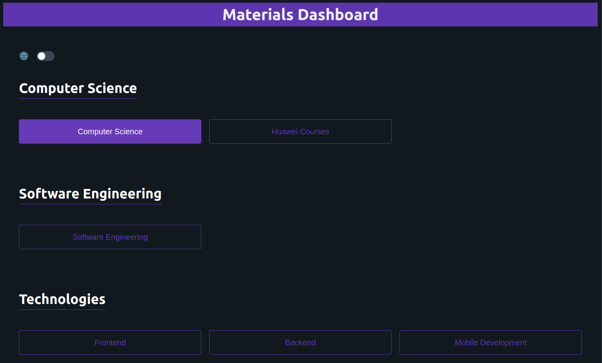
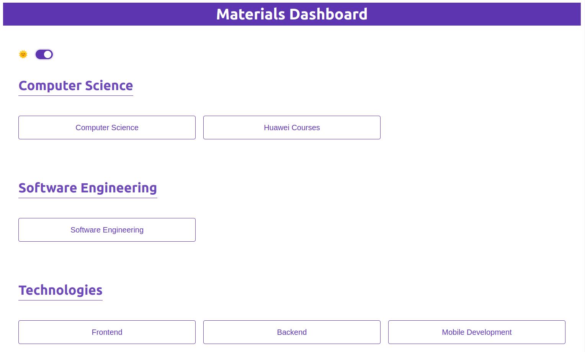

# Materials Navigation Dashboard

Materials Navigation is a dashboard for managing and accessing your study materials. It allows you to categorize your materials into different tabs in a Google Sheet, and then view them in a user-friendly interface with links to each tab.

## Motivation

The motivation behind this project was to solve the problem of having too many study materials to keep track of and navigate through. I wanted to have a better way to organize and access my materials, without having to scroll through a long list of tabs in a spreadsheet. I also wanted to have a visually appealing and customizable dashboard that suits my style and preferences.

Bonus: This project is a testament to the power of DIY. Don't settle for clunky tools or generic solutions. Take control, build your own oasis, and conquer the study material jungle!

## Technologies

This project was built with the following technologies:

- React: A JavaScript library for building user interfaces
- Vite: A fast and lightweight frontend development tool
- PicoCSS: A minimal and responsive CSS framework
- CSS Grid: A native CSS layout system for creating grid-based layouts

## Screenshots

### Dark Theme

### Light Theme

## Features

Some of the features of this project are:

- A simple and intuitive interface for viewing and accessing your study materials
- A dynamic and responsive layout that adapts to different screen sizes and orientations
- A customizable theme that lets you change the colors, fonts, and icons of the dashboard
- A lightweight and minimal design that focuses on the content and avoids distractions

## Installation

To install and run this project, you need to have Node.js and npm installed on your machine. Then, follow these steps:

1. Clone this repository to your local machine: `git clone https://github.com/AhmedGamal2212/materials-navigation.git`
2. Navigate to the project folder: `cd materials-navigation`
3. Install the dependencies: `npm install`
4. Start the development server: `npm run dev`
5. Open your browser and go to `http://localhost:5173`

## Usage

To use this project, you need to have a Google Sheet with your study materials organized into different tabs. Each tab should have a name and a link to the corresponding material. For example, you can have tabs like "Math", "Physics", "English", etc. with links to online courses, books, videos, etc. You can then use the sharable link of the Google Sheet without the 'gid' of the spreadsheet and set it as the value of the 'BASE_URL' variable in the 'data.js' file in the 'src' folder.

Additionally, you need to go to the 'data.js' file in the 'src' folder and change the 'SHEET_DETAILS' with the 'gid' for each tab taken from the url of the tab, title of the spreadsheet, and a category to group related tabs together.
After that, you need to modify the 'PRIORITY_LIST' to include all the categories you have, and the order you want them to appear in the dashboard. (Small numbers have higher priority and will appear first)

***Tip:*** You can use big gaps between the numbers to leave space for adding new categories later, or reordering the existing ones without having to change all the numbers.

You should now see your tabs and links in the dashboard. You can click on any tab to open the corresponding spreadsheets in a new tab.

To customize the theme of the dashboard, you can edit the `src/index.css` file. You can change the values of the CSS variables to modify the colors, fonts, and icons of the dashboard. For example, you can change the `--primary-color` variable to change the main color of the dashboard.

## Contributing

This project is open for contributions. If you have any ideas, suggestions, or feedback, feel free to create an issue or a pull request. You can also contact me at ahmedgamal.ssaleh@gmail.com. I appreciate any kind of help or support. Thank you!
